[Investigación del tema](index.md) / [Planeación de la actividad](planeacion_de_la_actividad.md) / [Resultados del taller](resultados_del_taller.md) / [Fotos](fotos.md)

# Fotos

## Preparación de la actividad

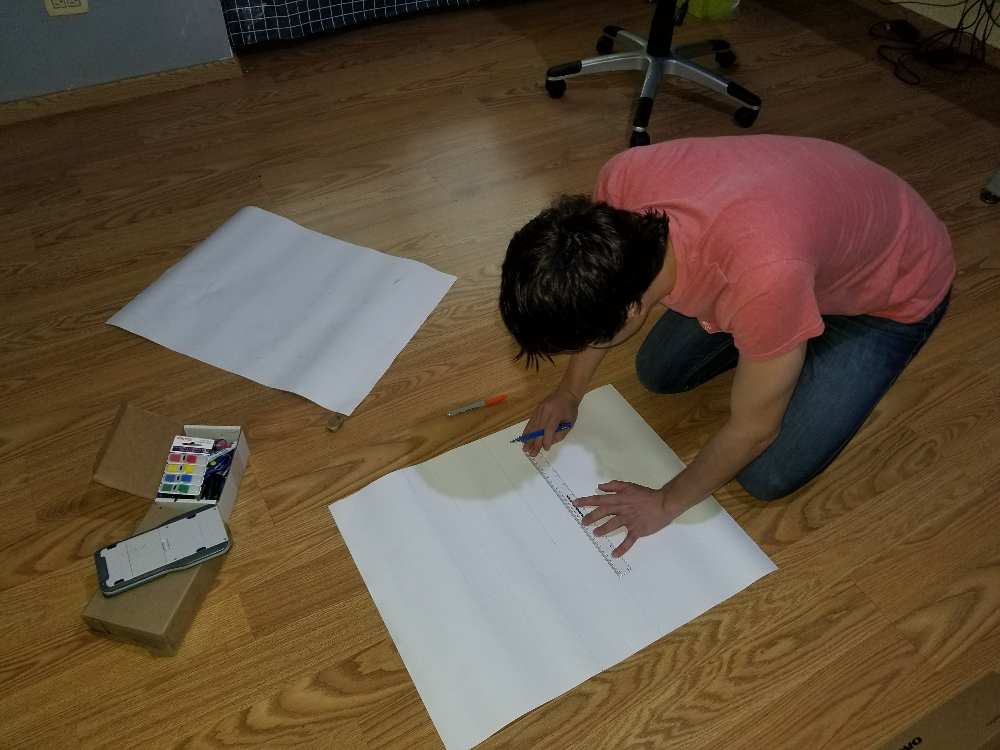

Evidencia 1. Haciendo el cartel del reglamento para los alumnos.

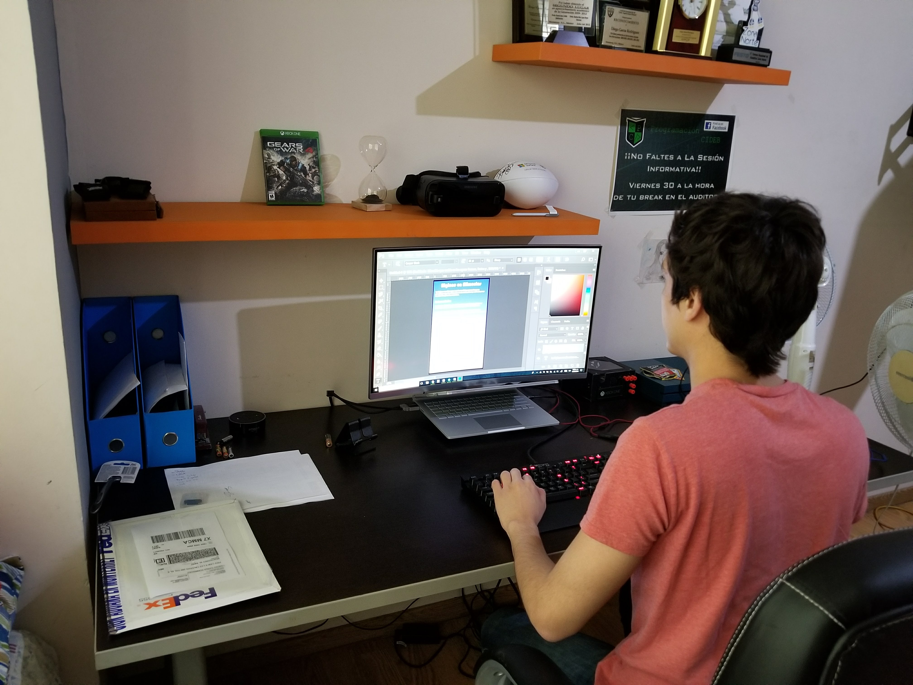

Evidencia 2. Diseñando los posters para la actividad “Higiene en Alimentos”.

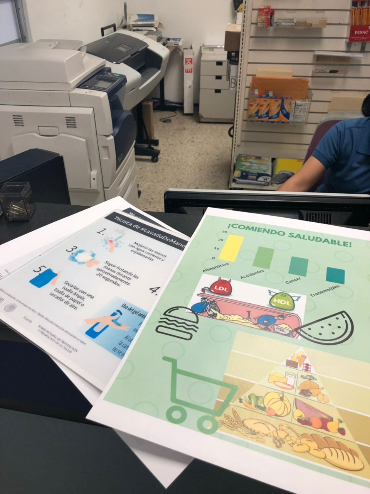

Evidencia 3. Impresión de los posters.

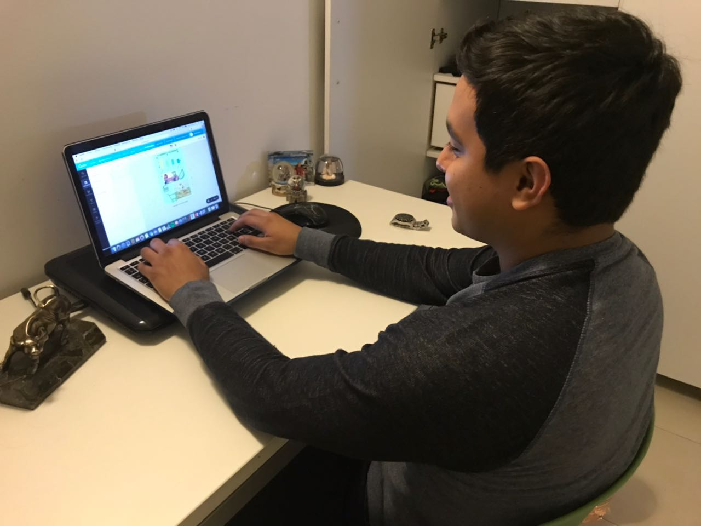

Evidencia 4. Realización de los posters.

## Realización del taller

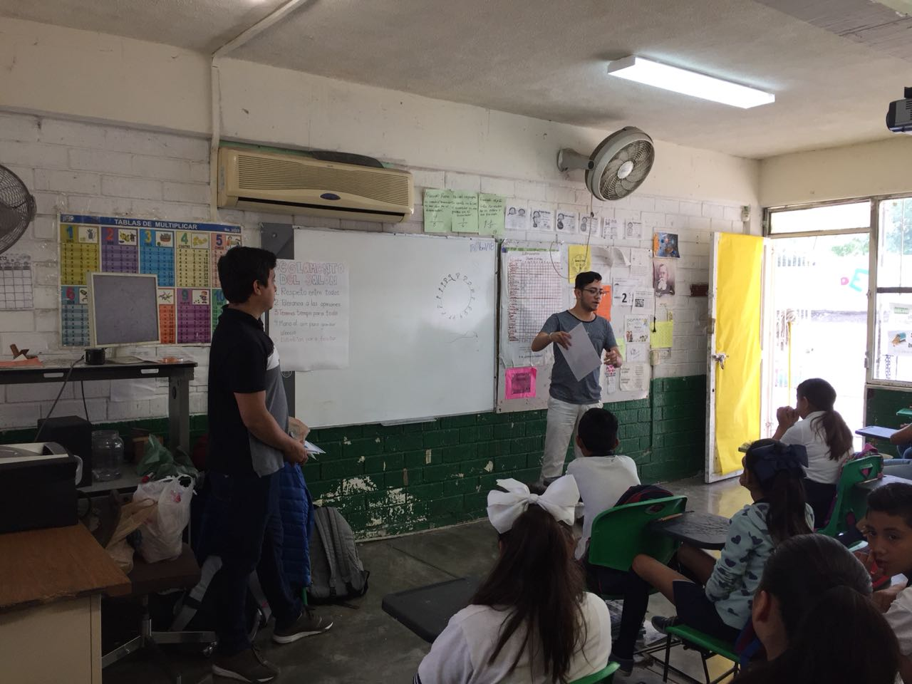

Evidencia 5. Impartiendo el reglamento del salón.

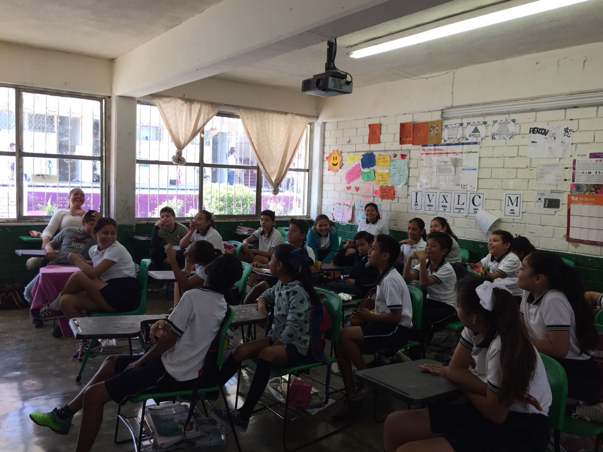

Evidencia 6. Grupo de 5to año de la primaria Eugenio Garza Sada.

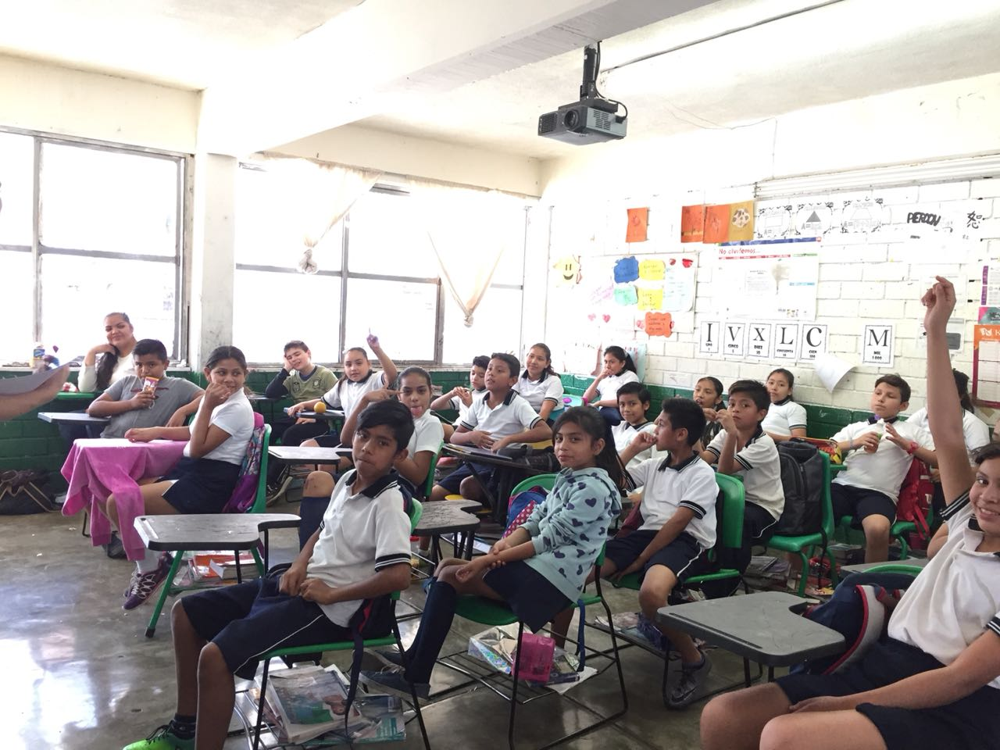

Evidencia 7. Participación de los niños en preguntas.

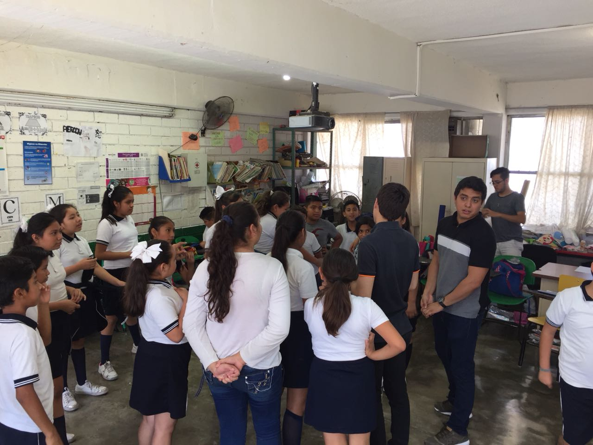

Evidencia 8. Actividad de integración, "Barcas para".

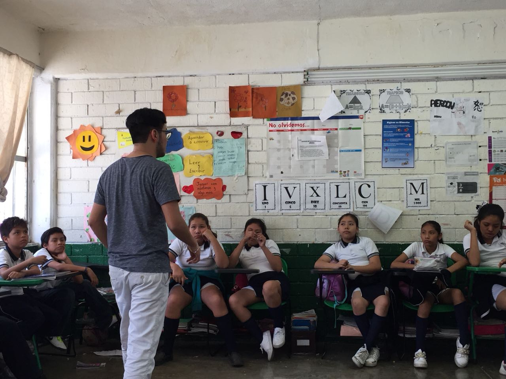

Evidencia 9. Plática sobre el correcto lavado de las manos.

Evidencia 10. Plática sobre la importancia del ejercicio.

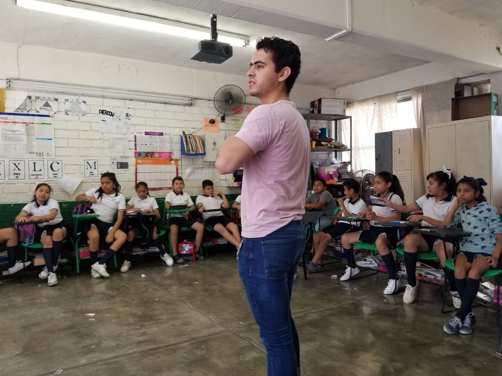

Evidencia 11. Actividad sobre la pirámide alimenticia.

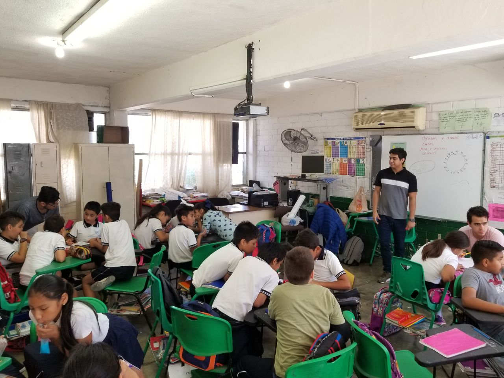

Evidencia 12. Actividad "el viaje" de integración.

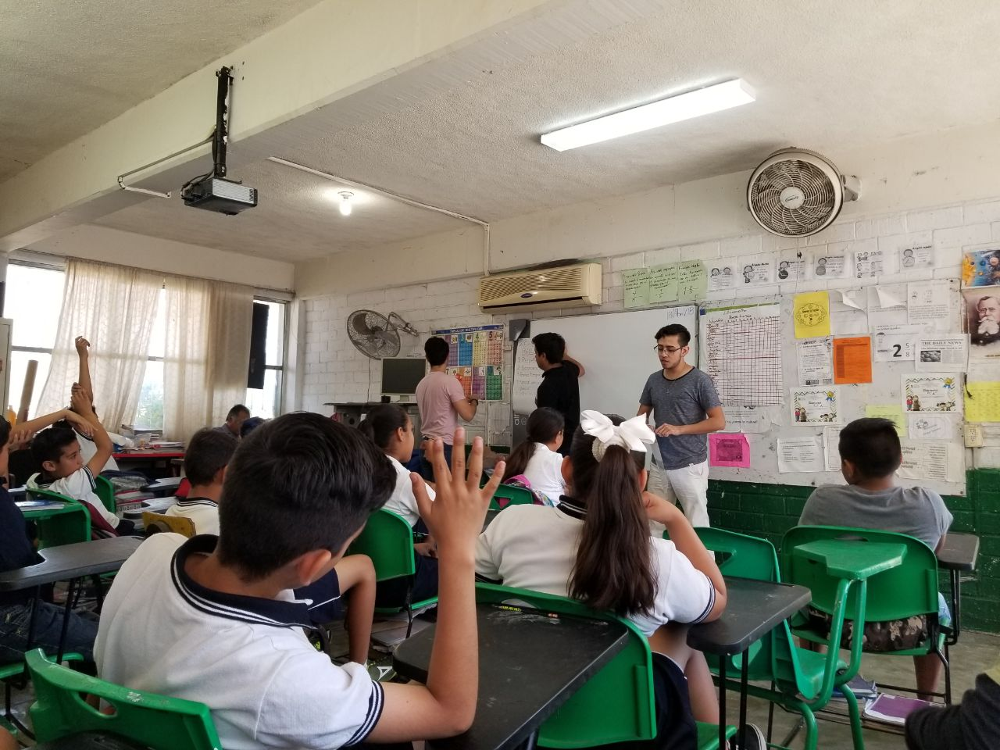

Evidencia 13. Plática sobre higiene en los alimentos.

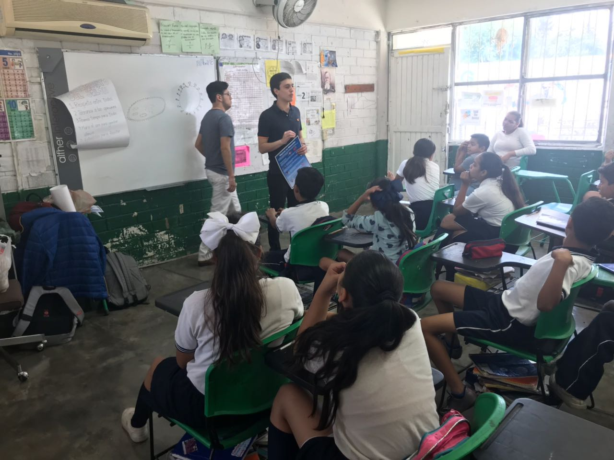

Evidencia 14. Foto con el grupo impactado por el taller.

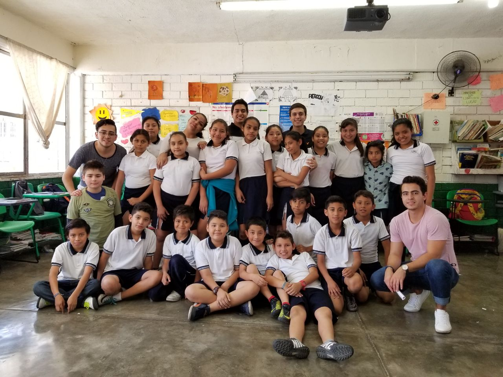

Evidencia 15. 

