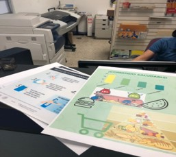

[Investigación del tema](index.md) / [Planeación de la actividad](planeacion_de_la_actividad.md) / [Resultados del taller](resultados_del_taller.md) / [Fotos](fotos.md)

# Fotos

## Preparación de la actividad

Evidencia 1. Haciendo el cartel del reglamento para los alumnos.

Evidencia 2. Diseñando los posters para la actividad “Higiene en Alimentos”.

Evidencia 3. Realización e impresión de los posters.

## Realización del taller
