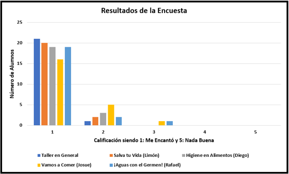

[Investigación del tema](index.md) / [Planeación de la actividad](planeacion_de_la_actividad.md) / [Resultados del taller](resultados_del_taller.md) / [Fotos](fotos.md)

# Resultados del taller

## ¿Se lograron los objetivos del proyecto?

Después de visitar la escuela y trabajar con los niños, nosotros  consideramos que cumplimos con todas las metas y objetivos que nos propusimos, los cuales fueron exponer los temas de manera dinámica a los niños de tal forma que ellos pudieran divertirse y aprender al mismo tiempo. Al final del día, nuestra meta era poder organizarnos de manera que el tiempo que estuviéramos ahí fuera suficiente para poder cada quien dar la plática que organizó y/o la actividad. En general, logramos aplicar nuestras propuestas y actividades en el tiempo indicado con muy poco tiempo de sobra, viendo cómo los niños se la pasaron entretenidos y como al final aprendieron algo sobre la salud e higiene.

El objetivo de nuestra visita a la escuela Eugenio Garza Sada era convivir con los niños de 5to grado haciendo actividades con ellos en relación a la higiene y salud en general, para poder dejarles un aprendizaje que les sirviera en su vida diaria. Nosotros consideramos que al acabar el día, logramos este objetivo, pues durante las actividades, estuvimos viendo cómo los niños si nos pusieron atención y cuando se les hacían preguntas ellos contestaban rápidamente varios a la vez. Después de dar las pláticas en relación a la higiene en el alimento y a la práctica de lavarse las manos, se les puso una actividad, “¡Vamos a Comer!”, donde dos de los niños, un hombre y una mujer, iban a hacer un sandwich con un recurso limitado de 10 pesos, cada cosa tenía un costo, el pan, la lechuga, el queso, el tomate, etc. Esta actividad fue en la primer parte del día y nos demostró como ellos ya habían aprendido algo sobre la salud e higiene, pues al hacer el sándwich lo primero que ellos hicieron fue lavarse las manos y después no volver a tocar las monedas que les habíamos asignado, pues consideraban que estas estaban sucias y no podían agarrar la comida si habían tocado el dinero sucio. Aquí nos demostraron como en las dos pláticas que les dimos, si pusieron atención y aprendieron a fijarse más en sus alimentos, aunque al final, ninguno pregunto si las verduras habían sido lavadas, pero sin considerar eso, podemos ver que habíamos cumplido nuestro objetivo.

En la segunda parte del día, seguimos con nuestras actividades, pero al final, se les hizo un repaso de todo lo que se había aprendido, con el fin de ver si después de varias horas, aún se acordaban de algo. Los resultados fueron positivos, pues en conjunto lograron decirnos los temas que vimos y cosas importantes de cada tema, desde cómo se deben lavar las manos, hasta el por qué es importante el ejercicio para ellos. Nos demostraron que si habían aprendido varias cosas todos y que si existía un interés por el tema, pues durante el día, después de la plática de lavarse las manos, todos los niños que regresaron de recreo o que salieron al baño, seguían las indicaciones que les habíamos dejado en cómo lavarse las manos, siempre agarraban el jabón y se tardaban 20 segundos limpiando bien sus dedos y sus uñas. Al ver todo esto en el transcurso del día, como equipo estamos seguros que logramos cumplir nuestra meta de hacer todas nuestras actividades en el tiempo asignado y cumplir nuestro objetivo de dejarles a los niños una enseñanza de salud e higiene que ellos podrán seguir practicando.

## Resultados de la Encuesta

Posterior a las actividades y pláticas, al final del día, se les aplicó una encuesta. Los resultados fueron muy positivos, pues la mayoría mostró un gusto por las pláticas además de que no hubo ninguna respuesta en 4 o 5, que eran los puntajes más bajos. Se les dejaron dos preguntas abiertas, las cuales fueron igual de positivas, estas fueron algunas de sus respuestas:

1.- ¿Qué es lo que más te gustó?
- Lo que más me gustó fue todo en general.
- Jugar enanos y gigantes.
- Los gérmenes.
- La higiene en los alimentos.

2.- ¿Qué es lo más valioso que te llevas de este taller?
- Lavarme los dientes.
- Respetar a las personas y esperar nuestro turno para hablar.
- Que tenemos que hacer ejercicio.

Gráfica 1. Resultados de la encuesta aplicada a los alumnos.

## Reflexiones

### Juan Gilberto Limón Rugerio

El servicio social fue un éxito, los niños mostraron una gran apertura y disposición con las actividades, se les veía en las caras su alegría, además de que mostraron un enorme respeto por nosotros. Todo el día fue planeado semanas antes, la verdad estábamos un poco nerviosos, principalmente por la incertidumbre de saber si les gustarían, o no las actividades, además de no saber si nos pondrían atención. La verdad es que lo que más me gustó fue su respeto por todos nosotros, a excepción de un niño que hacía lo que le daba la gana y molestaba otros niños, los demás estuvieron muy atentos a las actividades.

El principal objetivo del servicio social fue concientizarlos sobre el tema de la higiene, desde la higiene bucal y la manera correcta de lavarse las manos, hasta cómo preparar correctamente los alimentos. A mi parecer el objetivo se logró de manera exitosa. Se había planeado desde el inicio, darles pláticas el tiempo suficiente para que no se cansaran de estar sentados escuchando, posteriormente pasábamos a alguna actividad física. El horario estaba bien definido, llegamos puntuales, se logró mantener el orden dentro del aula y se respetó su horario de descanso, estos puntos hicieron posible que se lograran los objetivos establecidos desde un inicio. Yo creo que la manera de presentar el tema con plática y después actividad física fue la mejor manera de no perder su atención. Esa fue para mí, la mejor estrategia. Este servicio social me gustó más de lo que esperaba, normalmente no meto servicio social con niños, pues no me gusta lidiar con los pocos que no ponen atención, además de que es más exhaustivo; sin embargo, estos niños fueron muy amables y respetuosos, lo cual cambia mi perspectiva sobre el servicio social con niños.

Me quedo con una buena experiencia, además de que los niños también se quedaron con una buena experiencia. Solo espero que lo que les dijimos en las pláticas y lo que les enseñamos en las actividades, se les quede grabado, no solo haya sido un día de clases más, sino que verdaderamente les impacte y les sirva para su vida diaria, sobre todo, que repercuta en su salud, y que los mismos instructores (nosotros) también pongamos en práctica lo que les dijimos. 
 
### Josue Rafael Lopez Lares

La clase impartida a niños de primaria fue a mi parecer un gran éxito en cuanto a planeación, aprendizaje y conocimiento adquirido, ya que esta nos permitió salir de nuestra zona de confort a conocer sobre los niños de educación pública básica, conocimos muchos de sus problemas y carencias, entendimos por que piensan como piensan, porque tienden a fallar en la escuela y en general muchas de sus deficiencias generado principalmente por la mala calidad y pocos recursos brindados por los servicios gubernamentales a estas zonas de índices económicos relativamente bajos, sin embargo esto no nos impidió percatarnos de la alta capacidad y de las habilidades que estos niños poseían, se les veía entusiasmo, alegría e interés, eran personas muy contentas y enfocadas en las explicaciones, se interesaban, hacían preguntas y entendían todo muy rápido en general; y a pesar de algunas veces distraerse o prestar atención a otras cosas de vez en cuando siempre regresaba su interés por aprender y entender cosas nuevas.

La experiencia fue en general muy placentera, el grupo que nos tocó era en general bastante atento y callado, siempre andaban poniendo atención y prestando atención a las presentaciones, y a pesar de haber uno que otro niño que se distraía todos eran muy bien portados en general a excepción de uno el cual era bastante más relajiento. hubo una niña la cual nos llamo mucho la atencion ya que era muy callada y demaciado timida no solo a los profesores si no a sus compañeros en general llegando incluso a querer estar sola en algunas actividades que hacíamos en equipos.

La escuela en general nos recibió de muy buena manera, desde la directora que pasó a recibirnos hasta los maestros que nos apoyaron con las actividades y estando presentes en el salon, sin duda una de las cosas que mas me gusto en esta práctica fue el ver cómo los niños se interesaban en las explicaciones y hacían caso a las recomendaciones, por ejemplo en el caso del lavado de manos, en el cual me alegró mucho ver cómo los niños después de la presentación, dedicaron tiempo a lavarse las manos antes y después de entrar al salón de clases, en general fue una experiencia muy satisfactoria.

### Diego Garza Rodríguez

La actividad que hemos realizado en el transcurso del semestre ha sido muy beneficiosa tanto para los alumnos de la escuela primaria en que impartimos el taller, como para nosotros que lo llevamos a cabo. Desde que se definió el tema dentro del salón y se realizó la primera fase del proyecto, nos dimos cuenta por medio de la investigación, que era necesario hablarle a los niños en temprana edad de la gran importancia de la salud e higiene debido a que es un gran problema en nuestro país y, a su edad, es más sencillo de corregir estas deficiencias. El mayor reto lo tuvimos al planificar las actividades a impartir, cuestión elaborada en la segunda fase, debido a que necesitábamos comprender el razonamiento de los niños de quinto año de primaria para poder obtener su atención durante las 4 horas del taller y transmitir adecuadamente la información sintetizada por medio de actividades que permitirían su futura aplicación constante en el día a día del alumno.

Aprendimos a trabajar en equipo, en confiar en las responsabilidades de cada uno y asegurar el correcto desarrollo de los alumnos. Nos dimos cuenta que el dejar algunas cosas de lado, como es el utilizar el celular durante el taller, puede resultar un poco difícil al principio pero los resultados que transmitimos a los participantes es mucho mayor. A su vez, aprendimos que los niños de estas generaciones (especialmente los alumnos de la escuela Eugenio Garza Sada) están mayor capacitados en el tema de higiene y salud de lo que habíamos considerado en un principio, lo que nos permitió avanzar más rápidamente en las pláticas debido a su alto conocimiento en los temas. Este suceso me hace sugerir para futuras generaciones, aplicar una encuesta a los niños de la primaria donde se impartirá el taller antes de la fase uno del proyecto, con preguntas para conocer en cuáles temas de importancia los niños desconocen más y poder preparar las actividades del grupo en solucionar dicha situación. Considero que con una investigación previa, a lo mejor encontrábamos una problemática diferente a la salud e higiene de la cual los niños no tenían acceso a tanta información. A pesar de esto, consideramos que los niños aprendieron sobre el área y aplicarán estrategias en sus casas que ayudarán a mejorar la higiene en sus hogares.

### Rafael Chávez Delgadillo

La visita a la escuela Eugenio Garza Sada fue una experiencia diferente a las que me ha tocado vivir en servicio social, los niños demostraron su aprecio por la visita, se notó como querían escuchar y aprender. En las escuelas que me ha tocado ir, regularmente los niños no toman en cuenta el esfuerzo que uno hace por estar ahí y que aprendan de forma entretenida, pero los niños de 5to grado si. Aprendí que solo se necesita saber cómo llamar su atención y ver como son como nosotros, que si solo les hablas mucho, se aburren, por lo que al decidir hacer la clase más dinámica, fue más entretenido para ambas partes. Esta experiencia me gustó mucho, honestamente no pensé que me la fuera a pasar tan bien con los niños, pero en el momento que sentí interés por que ellos se llevaran algo de nuestra visita, empecé a disfrutar más la experiencia, la cual me gustaría volver a hacer, ya sea con los mismos niños o con otros. 

Al igual que ellos aprendieron, yo también aprendí de las pláticas de mis compañeros, muchas cosas yo no sabía, por lo que en un momento del día, me sentí como los niños, quienes estaban aprendiendo cosas que les sirviera el resto de su vida, pues yo actualmente, semanas después de la visita, tomó más en consideración muchas cosas de higiene y salud, por ejemplo lo de lavarse las manos, era algo que ya hacía, pero que después de la plática, ahora hago de una manera más completa y correcta, para protegerme de enfermedades. Otra cosa que aprendí fue sobre cómo se debe lavar bien las frutas, ya que esto lo vimos en la clase, pero nosotros se lo transmitimos a los niños en la visita, pues yo regularmente lavo mi fruta con puro jabón, cuando la realidad es que se ocupan lavar con un cepillo para poder quitar bien la tierra y otras bacterias que llegue a traer. 

Como ya lo mencione, la experiencia me gusto mucho, los niños se portaron muy bien con nosotros y el sentir que a ellos les importaba lo que teníamos que decir fue algo muy padre. La triste realidad es que también presenciamos como entre ellos no se tratan tan bien, por lo que el tener nuestro reglamento ayudo con eso, ya que nuestra primer regla era el respeto a todos y logre llamarle la atención a los que molestaban exigiendoles que respetaran a sus compañeros y que no es correcto tratar así a la gente. Ser maestro no es cosa fácil y menos con niños de 10 - 11 años, pero estuvo muy entretenido y me gustaria volverlo a hacer en alguna otra ocasión.
